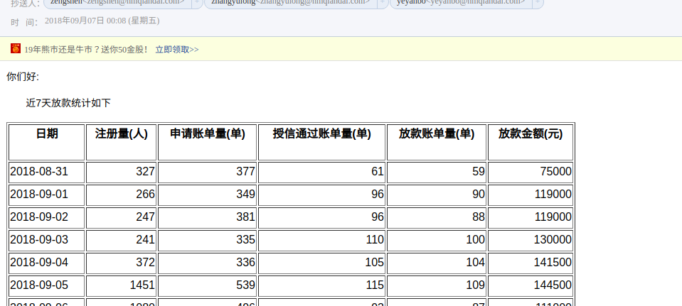

### 要求版本：
* python 3.6
* 源码安装在/home/devops/python3.6.2
* 在linux环境运行

### 部署
* git clone URL
* pip install pexpect

##### 以上为基础环境,必须安装好依赖包.

* pip install --upgrade setuptools
* pip install pipenv
* pipenv --python=/home/devops/python3.6.2/bin/python3.6
* pipenv shell
* pip install -r requirements.txt

### 运行
* cd sendmail
* pipenv shell
* cd bin
* python ttjiekuan_user.py

### 线上服务器
* 服务器:172.18.xxx.xx
* 目录:/home/devops/sendmail
* 运行方式:计划任务(crontab) 每天00:30

### 效果截图

